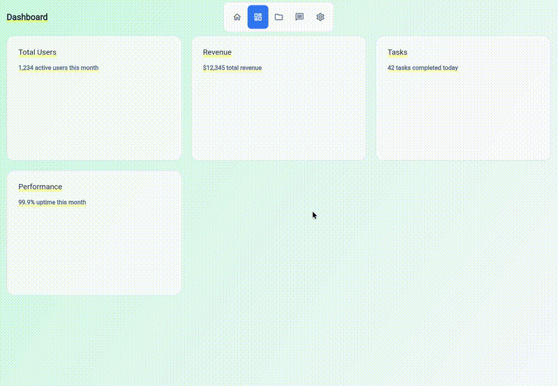

# Flutter Rail Layout

A Flutter package for creating horizontal rail layouts with animated floating tab bars featuring anchored expansion animation.

## Features

- **Floating Tab Bar**: A beautiful floating tab bar centered at the top
- **Anchored Expansion Animation**: Tab bar expands on hover with the hovered tab staying fixed
- **Page Title Header**: Automatic header with page title that updates based on current tab
- **Swipeable Pages**: Support for swipe gestures and keyboard navigation
- **Compact Design**: Optimized for nesting within other widgets
- **Customizable**: Extensive customization options for colors, styles, and animations

## Demo



## Installation

Add this to your package's `pubspec.yaml` file:

```yaml
dependencies:
  flutter_rail_layout: ^1.0.0
```

## Usage

### Basic Usage

```dart
import 'package:flutter_rail_layout/flutter_rail_layout.dart';

class MyApp extends StatelessWidget {
  @override
  Widget build(BuildContext context) {
    return MaterialApp(
      home: HorizontalRailLayout(
        tabs: [
          RailTab(
            label: 'Home',
            pageTitle: 'Dashboard',
            subtitle: 'Welcome back',
            icon: Icons.home,
            page: HomePage(),
          ),
          RailTab(
            label: 'Settings',
            pageTitle: 'Settings',
            subtitle: 'Configure your app',
            icon: Icons.settings,
            page: SettingsPage(),
          ),
        ],
      ),
    );
  }
}
```

### With Custom Options

```dart
HorizontalRailLayout(
  tabs: myTabs,
  initialIndex: 0,
  onPageChanged: (index) {
    print('Page changed to: $index');
  },
  enableKeyboardNavigation: true,
  headerHeight: 80,
  headerPadding: EdgeInsets.fromLTRB(24, 8, 24, 8),
  contentPadding: EdgeInsets.fromLTRB(24, 80, 24, 16),
  showSubtitle: true,
  tabBarActiveColor: Colors.blue,
  tabBarInactiveColor: Colors.grey,
)
```

## API Reference

### RailTab

| Property | Type | Description |
|----------|------|-------------|
| `label` | `String` | Short label displayed in the tab bar |
| `pageTitle` | `String` | Title displayed in the header |
| `subtitle` | `String` | Subtitle (shown when `showSubtitle` is true) |
| `icon` | `IconData` | Icon displayed in the tab bar |
| `page` | `Widget` | The widget to display as page content |
| `gradient` | `Gradient?` | Optional custom gradient for page background |

### HorizontalRailLayout

| Property | Type | Default | Description |
|----------|------|---------|-------------|
| `tabs` | `List<RailTab>` | required | List of tabs to display |
| `initialIndex` | `int` | `0` | Initial page index |
| `onPageChanged` | `ValueChanged<int>?` | `null` | Callback when page changes |
| `enableKeyboardNavigation` | `bool` | `true` | Enable arrow key navigation |
| `pageTransitionDuration` | `Duration` | `500ms` | Page transition duration |
| `pageTransitionCurve` | `Curve` | `easeOutCubic` | Page transition curve |
| `headerHeight` | `double` | `80` | Height of the header area |
| `headerPadding` | `EdgeInsets` | `(24, 8, 24, 8)` | Header area padding |
| `contentPadding` | `EdgeInsets` | `(24, 80, 24, 16)` | Page content padding |
| `showSubtitle` | `bool` | `false` | Show subtitle in header |
| `pageTitleStyle` | `TextStyle?` | `null` | Custom style for page title |
| `subtitleStyle` | `TextStyle?` | `null` | Custom style for subtitle |
| `tabBarBackgroundColor` | `Color` | `white` | Tab bar background |
| `tabBarBorderColor` | `Color` | `#E2E8F0` | Tab bar border |
| `tabBarActiveColor` | `Color` | `#3B82F6` | Active tab color |
| `tabBarInactiveColor` | `Color` | `#64748B` | Inactive tab color |
| `tabBarActiveTextColor` | `Color` | `white` | Active tab text color |

## Animation

The tab bar features a unique "anchored expansion" animation:

1. **Collapsed**: Shows only icons when not hovered
2. **Hover**: Detects which tab is being hovered
3. **Expand**: The hovered tab stays fixed while others expand outward
4. **Smooth**: Uses `easeOutCubic` curve for natural animations

## License

MIT License - see the [LICENSE](LICENSE) file for details.
